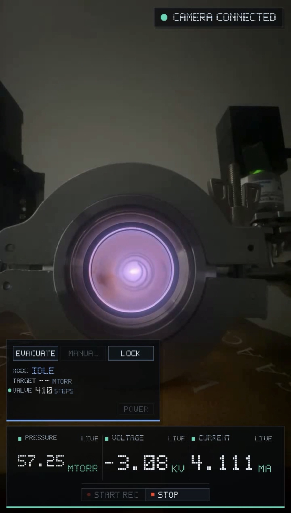

# Nuclear Fusor
A [nuclear fusor](https://en.wikipedia.org/wiki/Fusor) is a inertial electrostatic confinement device that uses a strong electric field to ionize deuterium gas and accelerate the ions toward the center of a vacuum chamber. This is accomplished by applying a large negative voltage to an inner metal grid (the cathode) relative to the grounded chamber wall (the anode). The chamber is operated at low pressure so that ions can travel significant distances and gain energy from the electric field before colliding with other particles. Near the center of the device, some ions collide with enough kinetic energy that, although they still cannot classically overcome the strong [Coulomb repulsion force](https://en.wikipedia.org/wiki/Coulomb's_law) between their positively charged nuclei, they can occasionally [tunnel](https://en.wikipedia.org/wiki/Quantum_tunnelling) through the Coulomb barrier and fuse, releasing energy and producing fusion products such as neutrons. These devices are purely experimental; they are highly energy-inefficient and have no commercial future. If you have to ask "then why would I build one?", you probably shouldn't.

## Project Description
Hardware, firmware, and desktop software for the fusor. The build employs 3 microcontrollers with Bluetooth Low-Energy (BLE). One is connected to the pressure gauge to send the pressure to the control panel, one takes in wires to read out and send the voltage and current, and the last mediates actuator commands to turn the valve remotely, so we can moderate the pressure in the chamber. The desktop app control panel brings the live readouts and valve controls together, with option to stream your phone camera to your computer so you can view the plasma at a safe distance. You can also replay recorded sensor logs and camera footage in the control panel for post-run analysis, in either standard or mobile view.



## Core Components
- a vacuum pump
  - https://www.amazon.com/Kozyvacu-Dual-Stage-HVAC-Vacuum-Pump/dp/B01N0SYCL4/ref=sr_1_1?sr=8-1
- a vacuum chamber with a view port
  - source these parts from ebay. Use KF or Conflat fittings.
- a high-voltage feedthrough into the chamber
- an inner grid connected to the feedthrough (ex. protein shaker ball)
- a variable power supply capable of at least -20kV at a few mA
- deuterium gas source (or just air for testing)
- MKS 901P pressure gauge
- pressure gauge readout board ([pressure-gauge-readout\hardware](pressure-gauge-readout/hardware))
-  remote-controlled valve ([valve-control/Parts.md](valve-control/Parts.md))
- ammeter/voltmeter readout board ([meter-readouts\hardware](meter-readouts/hardware))

## Repository Layout

| Path | Purpose |
| --- | --- |
| `control-panel/` | Windows OpenGL control panel for pressure, meter, valve control, sensor logging, camera background, and playback. |
| `meter-readouts/` | ESP32-C6 firmware and KiCad hardware for the high-voltage/current readout board. |
| `pressure-gauge-readout/` | ESP32-S3 firmware, desktop utilities, and KiCad hardware for the MKS 901P pressure gauge BLE bridge. |
| `valve-control/` | ESP32-C6 firmware for the stepper-driven valve controller. |
| `docs/` | Project notes and supporting documentation. |

Generated build outputs, local logs, camera media, reference papers, IDE state, and local tool installs are intentionally ignored.

## First-Time Setup

This repo has two toolchains:

- The Windows control panel uses CMake and the Visual Studio C++ build tools.
- The embedded firmware uses PlatformIO.

Use PowerShell from the repo root for the commands below.

### Install Control Panel Tools

Required:

- Windows 10 or newer.
- Git, available as `git`.
- CMake `3.21` or newer, available as `cmake`.
- Visual Studio 2022 Build Tools with the **Desktop development with C++** workload.
- OpenCV for Windows, either the official prebuilt package or your own CMake install.

Verify the command-line tools:

```powershell
git --version
cmake --version
```

If CMake cannot find a compiler, install or repair Visual Studio Build Tools and
make sure the C++ workload is selected. The first CMake configure also downloads
GLFW and SimpleBLE through CMake `FetchContent`, so it needs internet access.

OpenCV is not downloaded by this project's CMake configure step. See
`control-panel/README.md` for download links and the `OpenCV_DIR` setup flow.

### Install Firmware Tools

Required:

- Python 3
- PlatformIO Core
- USB driver support for the Seeed XIAO boards on your machine

Install PlatformIO Core with Python:

```powershell
pip install platformio
pio --version
```

The VS Code PlatformIO extension also works, but the documented commands use
PlatformIO Core so they can be run from any terminal.

## Quick Start

### Control Panel

The control panel is a CMake project that builds a Windows desktop app:

```powershell
$OpenCV_DIR = "<path-to-folder-containing-OpenCVConfig.cmake>"
cmake -S control-panel -B control-panel\build -DOpenCV_DIR="$OpenCV_DIR"
cmake --build control-panel\build --config Release
```

Run the control panel from the repo root:

```powershell
& "control-panel\build\Release\Fusor Control Panel.exe"
```

See `control-panel/README.md` for OpenCV setup, camera streaming, sensor logging, and
playback usage.

### Firmware

Each firmware project is built with PlatformIO from its own directory:

```powershell
cd meter-readouts\firmware
pio run
pio run -t upload
pio device monitor

cd ..\..\pressure-gauge-readout\firmware
pio run
pio run -t upload
pio device monitor

cd ..\..\valve-control\firmware
pio run
pio run -t upload
pio device monitor
```

Module-specific firmware behavior and BLE payloads are documented in:

- `meter-readouts/firmware/README.md`
- `pressure-gauge-readout/README.md`
- `pressure-gauge-readout/firmware/README.md`
- `valve-control/firmware/README.md`

## Common Setup Issues

- `cmake` is not recognized: install CMake `3.21` or newer and make sure it is
  added to `PATH`.
- CMake cannot find a C++ compiler: install Visual Studio 2022 Build Tools with
  the **Desktop development with C++** workload.
- CMake cannot find OpenCV: find `OpenCVConfig.cmake`, then pass the containing
  folder as `-DOpenCV_DIR="<that-folder>"`.
- The control panel starts but reports missing OpenCV DLLs: add the matching
  OpenCV `bin` folder to `PATH` in the same PowerShell session.
- `pio` is not recognized: install PlatformIO Core with
  `python -m pip install --upgrade platformio`, then reopen the terminal.
- PlatformIO cannot find the board or serial port: confirm the XIAO is connected
  over USB and visible to Windows before running `pio run -t upload`.

## BLE Devices

| Device | BLE name | Role |
| --- | --- | --- |
| Meter readout | `Fusor-Meter` | Publishes filtered high-voltage/current readings as `kv=<n>,ma=<n>,sat=<bits>`. |
| Pressure gauge | `PG-XIAO` | Publishes the MKS 901P pressure readout as text. |
| Valve control | `Fusor-Valve` | Publishes `pos=<n>,open=<n>,mode=<mode>` and accepts movement commands. |

The control panel discovers these devices automatically by BLE name/service UUID.

## Hardware

KiCad projects are included for the readout boards:

- `meter-readouts/hardware/MeterReadouts.kicad_pro`
- `pressure-gauge-readout/hardware/readoutPCB.kicad_pro`


## License
MIT.
